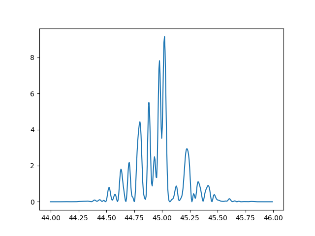
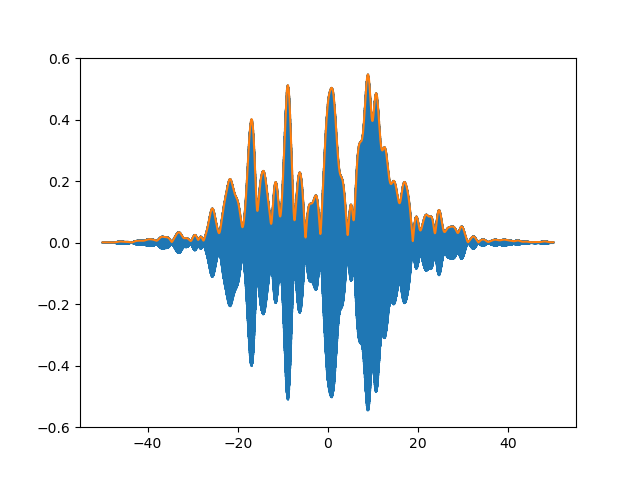
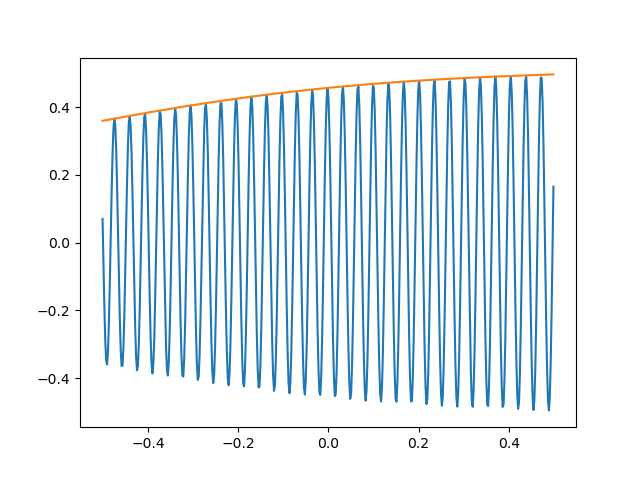

# random_pulse 
<!--  -->
<!-- [](https://www.python.org) -->
[](https://github.com/NilsSomm/random_pulse/blob/main/LICENSE)

## Introduction
This code uses the Partial Coherence Model (PCM) to simulate Self-Amplifed Spontaneous Emmission (SASE) Free-Electron Laser (FEL) pulses. SASE-FEL pulses are generated from random noise, so this is a stochastic process. The PCM method phenomenologically models stochastic SASE-FEL pulses from random number generation. The PCM algorithm is described in [T. Pfeifer et al., Optics Letters 35, 3441, (2010)](https://doi.org/10.1364/OL.35.003441).

## Overview
There are 3 main python classes included in this repository. The first class is `random_laser_pulse` and contains the PCM algorithm. The second class is `fel_pulse` class, which is a wrapper for the other class and provide support for unit conversion between between atomic units and SI units. We recommended using the `fel_pulse` class to generate SASE FEL pulses. Also included is the `pulse_detector` class, which can be used to systematically detect subpulses inside pulses generated.

## Examples
### Generating a Pulse
To generate a pulse, we call the `fel_pulse` function.
The required inputs are the pulse duration, bandwidth, and central frequency. In time the pulse is always centered around 0.
```
from fel_pulse import fel_pulse
pulse = fel_pulse(pulse_duration = 25, bandwidth = 0.55, central_freq = 45)
```
By default the input units are eV for frequencies and femtoseconds for time, however input and output units can also be switched to atomic units.
### Frequency Series
The frequency series provides the spectral information of a pulse, correspoding to the Fourier transform of its time series. To get the frequency axis you use the function `get_freq_domain` or `get_pos_freq_domain`, depending on whether you want to use the complete frequency series or an adjusted one that only contains the positive frequencies. The corresponding functions to get the frequency series are `get_freq_series` and `get_pos_freq_series`. For example, to plot the frequency series of a pulse, you might write something like this:
```
from matplotlib import pyplot as plt
import numpy as np
freq_domain = pulse.get_pos_freq_domain()
freq_series = pulse.get_pos_freq_series()
plt.plot(freq_domain, np.square(np.abs(freq_series)))
```
Which would generate a plot similar to this:


But here we can't see anything, so let's zoom in some. Here the fact that frequency 0 is at index 0 is used to get indeces for the frequency range we want to look at. For this the `get_freq_spacing` function is used, which returns the spacing between 2 consecutive points on the frequency axis.
```
freq_spacing = pulse.get_freq_spacing()
f_start = int(44 / freq_spacing)
f_end = int(46 / freq_spacing)
plt.plot(freq_domain[f_start:f_end], np.square(np.abs(freq_series))[f_start:f_end])
```


Now we can see the spikes in the pulse.
### Time Series
The time series of a pulse usually has very rapid oscillation modulated by a slower-varying envelope. In our code, the time envelope is calculated and stored in the `get_time_envlope` variable. For example, to get the time axis you use the function `get_time_axis`, and `get_time_series` and `get_time_envlope` for the series and corresponding envelope. Since time is centered around 0, for zooming in we base the central point at half the length of the axis and use the function `get_time_spacing` to get the spacing between two consecutive points on the time axis. If we want to see the time profile of a pulse along with its envelope, it can be done as such:
```
time_series = pulse.get_time_series()
time_domain = pulse.get_time_domain()
time_envelope = pulse.get_time_envelope()
time_spacing = pulse.get_time_spacing()
domain_len = len(time_domain)
zoom_range = 50
t_start = int((domain_len/2) - (zoom_range / time_spacing))
t_end = int((domain_len/2) + (zoom_range / time_spacing))
plt.plot(time_domain[t_start:t_end], time_series[t_start:t_end])
plt.plot(time_domain[t_start:t_end], time_envelope[t_start:t_end])
```


In blue is the time signal, and in orange is the envelope. If we again zoom by lowering the variable `zoom_range` to 0.5 we can see the oscillations of the time signal inside the envelope.



## Acknowledgments
This material is based upon work supported by the National Science Foundation under Grant No. PHY-2207656.
