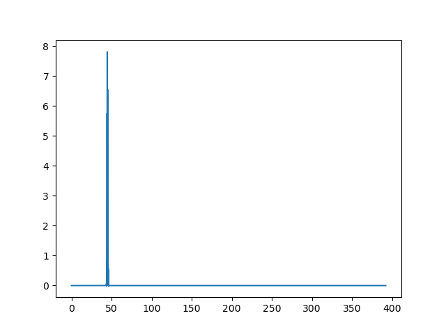
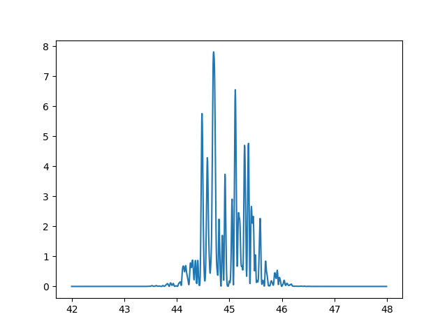

# random_pulse
## Introduction
This code uses the PCM (Partial Coherence Model) to simulate SASE (Self-Amplifed Spontaneous Emmission) FEL (Free-Electron Laser) pulses. These types of pulses form from random noise, so this is a stochastic process. The PCM method then makes use of random number generation to model this, and can be read about more Here: (T. Pfeifer et al., 2010), T. Pfeifer et al., Optics Letters 35, 3441, (2010).
## Overview
There are 2 included python classes in this repository. The first is the random_laser_pulse class, which contains the PCM algorithm. The second is the fel_pulse class, which is a wrapper for the other class. Here, inputs are simplified and there is an option to convert between atomic units and standard units. It is recommended to use the fel_pulse class.
## Examples
If you want to look at the frequency series of such a pulse, you might write something like this:
```
import numpy as np
from matplotlib import pyplot as plt
from fel_pulse import fel_pulse
pulse = fel_pulse('si', 'si', amplitude = 1, freq_spacing_factor = 0.02, pulse_duration = 25, bandwidth = 1, central_freq = 45)
freq_domain = pulse.get_pos_freq_domain()
freq_series = pulse.get_pos_freq_series()
plt.plot(freq_domain, np.square(np.abs(freq_series)))
```
Which would generate a plot similar to this:



But here we can't see anything so let's zoom in some.
```
freq_spacing = pulse.get_freq_spacing()
start = int(42 / freq_spacing)
end = int(48 / freq_spacing)
plt.plot(freq_domain[start:end], np.square(np.abs(freq_series))[start:end])
```


Now we can see the spikes in the pulse. 
