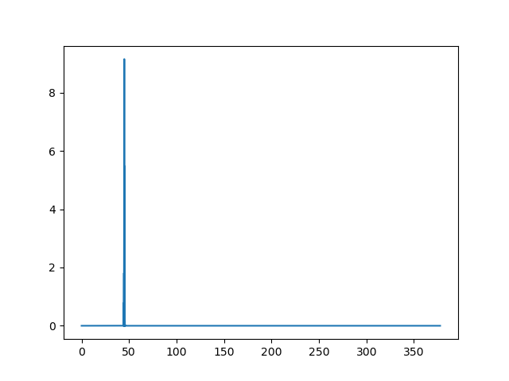

# random_pulse 
## Introduction
This code uses the Partial Coherence Model (PCM) to simulate Self-Amplifed Spontaneous Emmission (SASE) Free-Electron Laser (FEL) pulses. These types of pulses form from random noise, so this is a stochastic process. The PCM method phenomenologically models stochastic SASE-FEL pulses from random number generation to model this. The PCM algorithm is described [T. Pfeifer et al., Optics Letters 35, 3441, (2010)](https://doi.org/10.1364/OL.35.003441).

## Overview
There are 2 included python classes in this repository. The first is the `random_laser_pulse` class, which contains the PCM algorithm. The second is the `fel_pulse` class, which is a wrapper for the other class. Here, inputs are simplified and there is an option to convert between atomic units and standard units. It is recommended to use the `fel_pulse` class.

## Examples
### Generating a Pulse
To generate a pulse, we call the fel_pulse function.
The required inputs are pulse duration, bandwidth, and central frequency. In time the pulse is always centered around 0.
```
from fel_pulse import fel_pulse
pulse = fel_pulse(pulse_duration = 25, bandwidth = 0.55, central_freq = 45)
```
By default the input units are eV for frequencies and femtoseconds for time, however input and output units can also be switched to atomic units.
### Frequency Series
The frequency series of a pulse is the Fourier transform of its time series, meaning it is the same signal but composed of frequencies. If you want to inspect such a frequency series of a pulse, you might write something like this:
```
from matplotlib import pyplot as plt
import numpy as np
pulse = fel_pulse('si', 'si', amplitude = 1, freq_spacing_factor = 0.02, pulse_duration = 25, bandwidth = 0.55, central_freq = 45)
freq_domain = pulse.get_pos_freq_domain()
freq_series = pulse.get_pos_freq_series()
plt.plot(freq_domain, np.square(np.abs(freq_series)))
```
Which would generate a plot similar to this:



But here we can't see anything, so let's zoom in some.
```
freq_spacing = pulse.get_freq_spacing()
f_start = int(44 / freq_spacing)
f_end = int(46 / freq_spacing)
plt.plot(freq_domain[f_start:f_end], np.square(np.abs(freq_series))[f_start:f_end])
```


Now we can see the spikes in the pulse.
### Time Series
The time series of a pulse usually has very rapid oscillation inside of longer oscillations. Because of this, the time envelope is also calculated when a pulse is generated. If we want to see the time profile of a pulse along with its envelope, it can be done as such:
```
time_series = pulse.get_time_series()
time_domain = pulse.get_time_domain()
time_envelope = pulse.get_time_envelope()
time_spacing = pulse.get_time_spacing()
domain_len = len(time_domain)
t_start = int((domain_len/2) - (50 / time_spacing))
t_end = int((domain_len/2) + (50 / time_spacing))
plt.plot(time_domain[t_start:t_end], time_series[t_start:t_end])
plt.plot(time_domain[t_start:t_end], time_envelope[t_start:t_end])
```


In blue is the time signal, and in orange is the envelope. If we again zoom in on this we can see the oscillations of the time signal inside the envelope.


